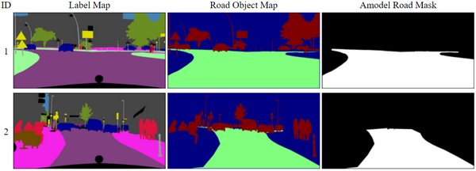
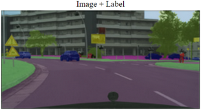

# HTML4Vision
Simple HTML visualization for computer vision projects

https://github.com/mtli/HTML4Vision



- Easy [table description and generation](#table-description-and-generation) for algorithm comparison and pipeline visualization
- Handy [formatting controls](#formatting) to make nice figures
- [Web publishing](#web-publishing) for remote browsering

## Installation
```
pip install html4vision
```
[](https://badge.fury.io/py/HTML4Vision)

## Table description and generation

You can use glob patterns (e.g. `results/*_method_2.png`) to specify the content and use `imagetable()` to generate the table automatically.
```python
from html4vision import Col, imagetable

# table description
cols = [
    Col('id1', 'ID'), # make a column of 1-based indices
    Col('img', 'Method 1', 'results/*_method_1.png'), # specify image content for column 2
    Col('img', 'Method 2', 'results/*_method_2.png'), # specify image content for column 3
]

# html table generation
imagetable(cols)
```
Example: `examples/basic.py`

### Descriptor syntax

The table is described by a list of `Col` objects. 
```
Col(type, name, content, subset, style)
```
- `type`: 'text' for text, 'img' for images, 'overlay' for [image overlay](#image-overlay), 'id0' for zero-based indices and 'id1' for one-based indices.
- `name`: the name of the column.
- `content`: for images (both 'img' and 'overlay'), it is a [glob pattern](); for text, it is a list of strings; it is `None` for all other types (indexing is automatic).
- `subset`: subset selection of the `content` provided. If `subset` is a single integer, it is interpreted as length `n` and the first `n` items are selected; if `subset` is a `tuple`, it is interpreted in the form of `(start, stop)` or `(start, step, stop)`; if `subset` is a `list`, it is interpreted as a list of indices to be selected.
- `style`: a string of CSS rules for the entire column. See [styling through CSS](#styling-through-CSS) for more.

### Generation syntax
```python
imagetable(cols, outfile='index.html', title='', imsize=None, imscale=1, style=None)
```
The meaning of the first three arguments are straightforward. Please refer to [size control](#size-control) for controlling the image size with `imsize` and `imscale`. The `style` is a string of CSS rules for the entire HTML document.

## Web publishing

Web publishing is designed for sharing the visualized results. Typically it can be used for sharing the results with others or viewing the results on a remote compute node without downloading them in advance. Of course, it can also be used as a general purpose HTTP server.

The script provided here is functionally similar to the `SimpleHTTPServer` in Python 2 and serves the files in the current directory. It supports both Python 2 & 3 and uses mutiple threads for a much better web experience. For security reasons, directory browsing is disabled and accessing files outside of the current directory is not allowed. So you need to type in the exact HTML file name (e.g. `http://127.0.0.1:6096/index.html`) to access.

Change the current directory to the directory you want to serve and run
```
python -m html4vision.server
```
The default port is 6096. To specify a port (e.g. 23333), run
```
python -m html4vision.server 23333
```

## Formatting

### Size control

The image size is controlled by `imsize` and `imscale` arguments. Note that all scaling is done through Javascript which takes place after the content of the webpage is loaded.

`imsize` can be either a single index or a `tuple` or a `list` of width and height. If it is a single index, it means scaling the images in all other columns to match the corresponding image in the column specified by the index. The index is zero-based and refers to the items in the list of `Col` objects. Understanding the indexing is important when you also use image overlay where two objects describe a single column. For example, you can scale the intermedate feature maps of a convolutional nerual network (CNN) to match the size of the input image. If `imsize` is a `tuple` or a `list` of width and height, then all images will be scaled to that size.

`imscale` is a factor to scale the image. When used in combination with `imsize`, the `imscale` is applied after the effects of `imsize`.

### Image overlay



Two consecutive `Col` objects form a single image column. The first `Col` object describes the bottom image while the second describes the top image. Their types need to be 'img' and 'overlay' respectively. If the top image by itself is not transparent, you can specify its opacity by adding `opacity: 0.5` (value range from 0 to 1) to the `style` field.

Example: `examples/overlay.py`

### Styling through CSS

Since the generated table is in HTML, you can have much more freedom in controling the format through CSS. Below is a simple example of highlighting a particular column and particular row by changing the background color. But of course, you can do a lot more with CSS.

Example: `examples/formatting.py`